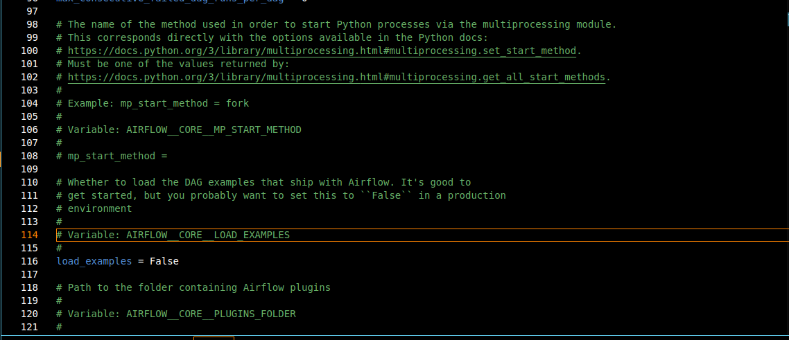
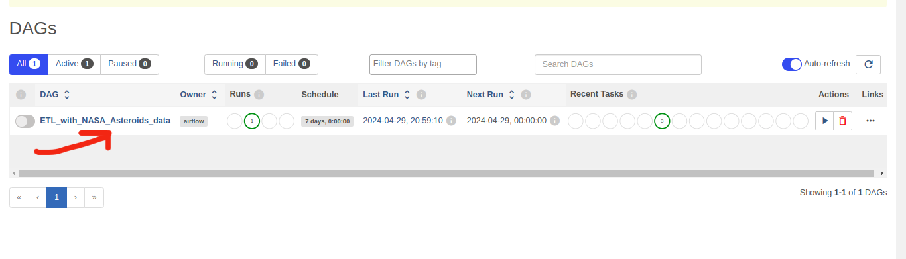
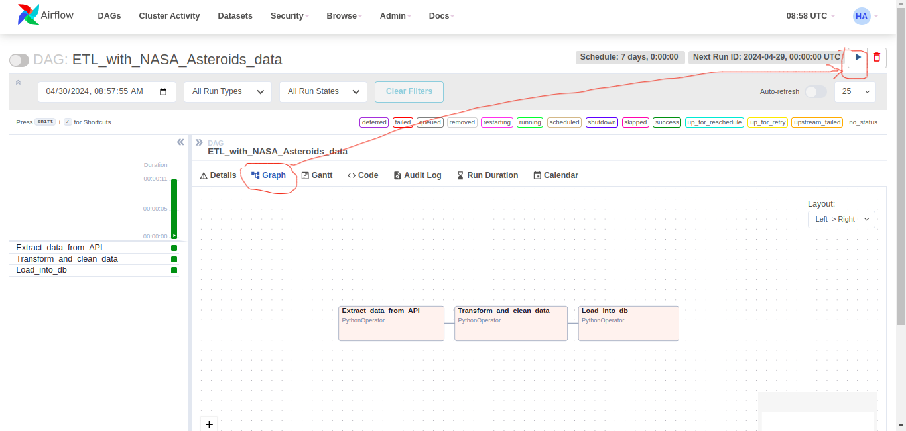

# ETL-Asteroids_data

This is a simple airflow ETL with data from one of the NASA APIs: Asteroids - NeoWs. It consists of extracting data about orbiting around earth asteroids, put relevants data into a python dataframe, and loading them into a MongoDb database in a ready for analysis format. The pipeline is scheduled to run once weekly.

# Steps to reproduce.

## Generate a NASA developer key

In order to use the NASA API you will need to get an API key [here](https://api.nasa.gov/#signUp)

## Python environment

Create a Pyhton environment:

```bash
python -m venv venv
```
Activate it:

```bash
source ./venv/bin/activate
```

## Install airflow

You can find the installation on the [official Airflow website](https://airflow.apache.org/docs/apache-airflow/stable/start.html)


## Set environment variables

```bash
export AIRFLOW_HOME=/path/to/your/airflow/home
export API_KEY=your_nasa_api_key
export URL=url_of_the_request
export TEMP_PATH=path/to/your/temporary/json/data
export DATABASE_STR=database_connection_string
```

## Airflow cfg

For clarity purpose, disable the display of example DAGs in airflow in your airflow.cfg file.



## Run Airflow webserver and Airflow scheduler in detach mode

```bash
airflow webserver -D
airflow scheduler -D
```

## Airflow UI






